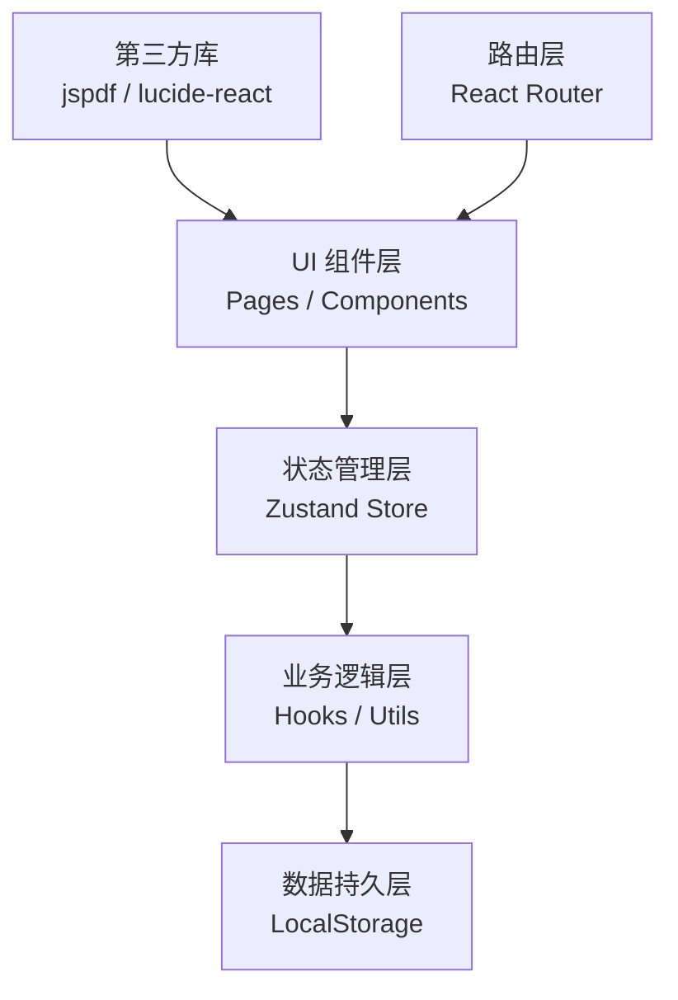

## 1. 架构设计

纯前端单页应用，采用 React 组件化架构，所有数据存储在浏览器本地。整体分为四层：UI 组件层、状态管理层、业务逻辑层、数据持久层。



## 2. 技术说明

- **前端框架**：React@18 + TypeScript + Vite
- **状态管理**：zustand（轻量级，支持持久化）
- **路由**：react-router-dom
- **样式方案**：Tailwind CSS 3
- **图标库**：lucide-react
- **PDF 导出**：jspdf + html2canvas
- **数据持久化**：localStorage + zustand persist 中间件
- **初始化工具**：vite-init

## 3. 路由定义

| 路由路径 | 页面组件 | 功能说明 |
|-------|---------|---------|
| `/` | 重定向到 `/create` | 默认入口 |
| `/create` | CreatePage | 创建页：项目卡片编辑、背景填写、过程标注 |
| `/diagnose` | DiagnosePage | 诊断页：专业选择、能力分析、完整性检查 |
| `/compare` | ComparePage | 对照页：结构预览、版本对比 |
| `/export` | ExportPage | 导出页：清单生成、PDF导出、离线管理 |

## 4. 数据模型

### 4.1 核心数据类型定义

```typescript
interface Project {
  id: string;
  title: string;
  startDate: string;
  endDate: string;
  role: string;
  description: string;
  outputs: string[];
  difficulties: string[];
  growth: string;
  processNodes: ProcessNode[];
  order: number;
  createdAt: number;
  updatedAt: number;
}

interface ProcessNode {
  id: string;
  title: string;
  date: string;
  description: string;
  type: 'learning' | 'breakthrough' | 'milestone' | 'challenge';
}

interface Background {
  education: Education[];
  experience: Experience[];
  skills: Skill[];
  motivation: string;
}

interface Education {
  id: string;
  school: string;
  major: string;
  degree: string;
  startDate: string;
  endDate: string;
}

interface Experience {
  id: string;
  company: string;
  position: string;
  startDate: string;
  endDate: string;
  description: string;
}

interface Skill {
  id: string;
  name: string;
  level: 'beginner' | 'intermediate' | 'advanced' | 'expert';
  category: string;
}

interface TargetProgram {
  id: string;
  school: string;
  major: string;
  degree: string;
  deadline: string;
  requirements: ProgramRequirement[];
}

interface ProgramRequirement {
  id: string;
  dimension: string;
  description: string;
  weight: number;
}

interface AbilityGap {
  dimension: string;
  currentLevel: number;
  requiredLevel: number;
  gap: number;
  suggestions: string[];
}

interface MaterialCheckItem {
  id: string;
  category: string;
  item: string;
  required: boolean;
  completed: boolean;
  priority: 'high' | 'medium' | 'low';
  notes: string;
}

interface PortfolioVersion {
  id: string;
  name: string;
  createdAt: number;
  description: string;
  data: PortfolioData;
}

interface PortfolioData {
  projects: Project[];
  background: Background;
  targetProgram: TargetProgram | null;
  materialChecklist: MaterialCheckItem[];
}

interface SubmissionItem {
  id: string;
  category: string;
  item: string;
  deadline: string;
  completed: boolean;
  notes: string;
}
```

### 4.2 院校专业偏好数据（预置 Mock 数据）

内置常见转专业方向的招生偏好数据，包括：
- 计算机科学（CS）
- 交互设计（HCI/IXD）
- 数据科学（Data Science）
- 商业分析（Business Analytics）
- 建筑学（Architecture）
- 数字媒体（Digital Media）

## 5. 核心目录结构

```
src/
├── components/          # 可复用组件
│   ├── layout/         # 布局组件（导航、页脚、侧边栏）
│   ├── projects/       # 项目卡片相关组件
│   ├── diagnose/       # 诊断相关组件
│   ├── compare/        # 对照相关组件
│   ├── export/         # 导出相关组件
│   └── ui/             # 基础UI组件（按钮、表单、卡片等）
├── pages/              # 页面组件
│   ├── CreatePage.tsx
│   ├── DiagnosePage.tsx
│   ├── ComparePage.tsx
│   └── ExportPage.tsx
├── store/              # 状态管理
│   └── usePortfolioStore.ts
├── hooks/              # 自定义 Hooks
│   ├── useDragDrop.ts
│   ├── useLocalStorage.ts
│   └── useDiagnosis.ts
├── utils/              # 工具函数
│   ├── pdfExport.ts
│   ├── diagnosis.ts
│   ├── versionControl.ts
│   └── mockData.ts
├── types/              # TypeScript 类型定义
│   └── index.ts
├── App.tsx             # 根组件
├── main.tsx            # 入口文件
└── index.css           # 全局样式
```

## 6. 状态管理设计

使用 zustand  create 函数创建全局 store，包含：

```typescript
interface PortfolioState {
  projects: Project[];
  background: Background;
  targetProgram: TargetProgram | null;
  materialChecklist: MaterialCheckItem[];
  versions: PortfolioVersion[];
  currentVersionId: string | null;
  
  // Projects actions
  addProject: (project: Omit<Project, 'id' | 'createdAt' | 'updatedAt'>) => void;
  updateProject: (id: string, updates: Partial<Project>) => void;
  deleteProject: (id: string) => void;
  reorderProjects: (fromIndex: number, toIndex: number) => void;
  
  // Background actions
  updateBackground: (background: Partial<Background>) => void;
  
  // Diagnosis actions
  setTargetProgram: (program: TargetProgram) => void;
  generateDiagnosis: () => AbilityGap[];
  checkMaterialCompleteness: () => MaterialCheckItem[];
  
  // Version control
  saveVersion: (name: string, description: string) => void;
  loadVersion: (versionId: string) => void;
  deleteVersion: (versionId: string) => void;
  compareVersions: (v1Id: string, v2Id: string) => VersionDiff;
  
  // Export actions
  generateSubmissionList: () => SubmissionItem[];
  exportToPDF: () => Promise<void>;
  exportToJSON: () => string;
  importFromJSON: (json: string) => void;
}
```

## 7. 关键技术实现要点

1. **拖拽排序**：使用原生 HTML5 Drag and Drop API 实现项目卡片重排序
2. **本地持久化**：zustand + persist 中间件，自动同步到 localStorage
3. **诊断引擎**：基于规则的评估系统，根据目标专业要求计算能力缺口
4. **PDF 导出**：jspdf + html2canvas 实现客户端 PDF 生成
5. **版本对比**：深度对比两个版本的数据对象，生成差异报告
6. **离线优先**：检测到网络状态变化时提示用户，确保离线可用
7. **数据导入导出**：支持 JSON 格式的全量数据备份和恢复
